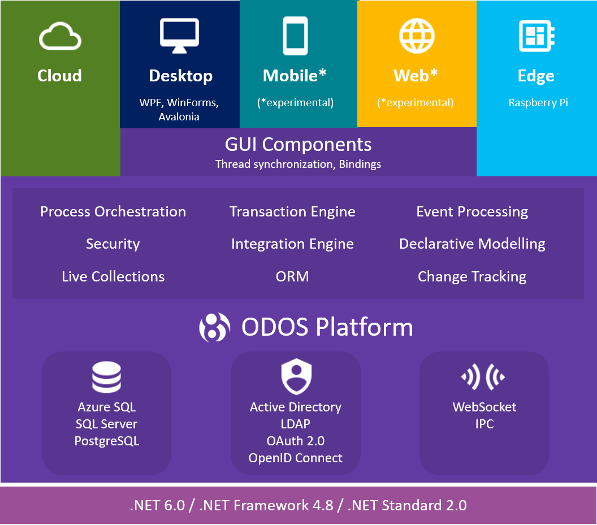

Introduction
===============

## 1. What is *ODOS*

*ODOS* is a universal framework to build enterprise grade applications using .NET.  ODOS is a foundation technology for n-tier applications solving the problem of transferring object state across all nodes in a consistent way. 

*ODOS* has also the following cool features:

* Real time state synchronization between all nodes of the system.
* Cross-platform support. Can run on Windows, Linux and macOS, experimental support for Android and iOS. Runs on .NET 5.0/6.0, .NET Core, .NET Framework and Mono.
* Ready-made transactional object server.
* Declarative Object Modelling. Metadata driven design of common object schema used across servers and clients. 
* Data store independent. Any database can be supported; currently MS SQL Server, Azure SQL, PostgreSQL and binary file are supported.
* Object Oriented Query Language (OOQL) is a language to effectively querying objects without writing SQL and is consistent across all supported Databases

*Currently there is only experimental support for Mobile and Web Applications 

## 2. N-Tier Applications & Object Managers

ODOS provides a simplified programming paradigm to develop N-Tier applications using .NET by providing the components to manage and exchange the Objects' State throughout all tiers. The high level components that are responsible for inter-process communication and object state management are the Object Managers (OM). Two main types of Object Managers exist. The Client Object Manager (COM) and the Server Object Manager (SOM). Server Object Managers are normally hosted on the services processes and Client Object Managers are hosted in Client Applications.   

## 3. ODOS Server

ODOS Server, that normally consists of a SOM, is an object server that acts as a middleware component throughout the whole architecture and manages data synchronization, transaction integrity, transaction publishing and client coordination. The ODOS Server can efficiently and simultaneously sync data across the system nodes and automatically resolve conflicts in real-time. Furthermore, it provides a single place to manage all connected clients, including gateways to third party systems.

ODOS Server also provides a built-in Object-Relational-Mapping (ORM) component that handles all the communication with the Database. Currently ODOS supports the Code-First data model creation.

## 4. ODOS Client

ODOS Client, that normally consists of a COM, is the process that is served by an ODOS Server. An ODOS client can be any type of .NET application, such as Desktop, Console, Mobile* or Web application*. Additionally any type of .NET GUI technology (Xamarin Forms, WPF, Avalonia, WinForms) is already supported or can be easily supported. 

An ODOS client can perform transactions upon an ODOS Server as well as retrieve data using OOQL (Object Oriented Query Language). It can also call Remote Procedure Calls (RPC) to other ODOS clients. 

## 5. DataItems

The DataItem are the ODOS aware .NET objects. In other words, the ODOS Object Managers manage the object that inherit from the abstract class DataItem. A DataItem is unique in the Object Manager registry and can be identified by the DataItemKey. A DataItem has 

## 6. Domains

An ODOS Domain is a named set of DataItem classes. Typically a Domain corresponds to a one Database and provides the transaction boundaries. Multiple Domains can be used by the object managers. The Domains are registered at the application startup. 
