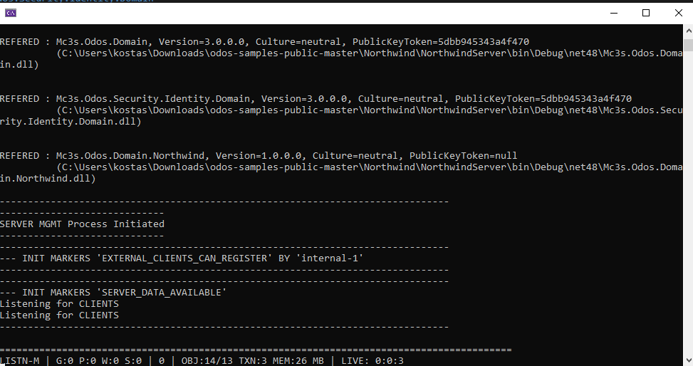
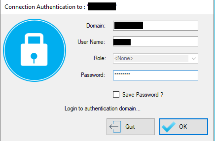
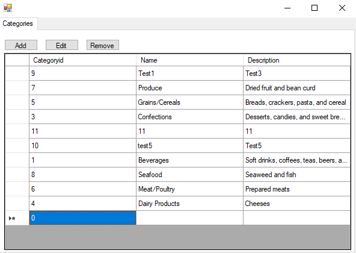
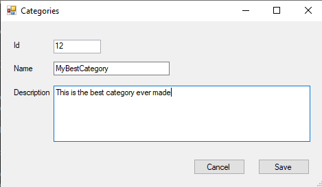
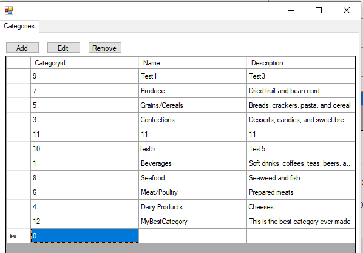

# Quick Start

## Introduction

This quick start guide will use the Northwind sample that can be found at the ODOS Sample applications repository <a href="https://github.com/Missionware/odos-samples-public" target="_blank">https://github.com/Missionware/odos-samples-public</a>. The Northwind sample contains a ready made data model (ODOS Domain) of the popular Northwind database, as well as some test data that you can be easily imported. So feel free to download or clone this repo. 

## Setup

Before downloading the source code of the sample you have to setup the ODOS nuget feeds in your Visual Studio installation. There is one feed for the ODOS nuget files and one for some Third Party libraries we use. So setup the two feeds you have been given using this <a href="https://docs.microsoft.com/en-us/azure/devops/artifacts/nuget/consume?view=azure-devops&tabs=windows" target="_blank">guide</a>.

Then download the source code and open the Northwind solution in Visual Studio. The Northwind sample application solution consists of three projects:

- The Northwind Domain project (Mc3s.Odos.Domain.Northwind)
- The Northwind Object Server (NorthwindServer)
- The Northwind Windows Forms Application (NorthwindWinFormsApp)


In NorthwindServer project head over to the app.config file. 

```xml
<?xml version="1.0" encoding="utf-8"?>
<configuration>

	<!-- Here we define the ODOS configuration sections for the server. 
	     The sections are: one per registered domain, one for Communication libraries and one for the Identity Store Configuration  -->
	<configSections>
		<section name="IdentityStoreSetup" type="ODOS"/>
		<section name="CommunicationSetup" type="ODOS"/>
		<section name="Mc3s.Odos.Domain" type="ODOS"/>
		<section name="Mc3s.Odos.Security.Identity.Domain" type="ODOS"/>
		<section name="Mc3s.Odos.Domain.Northwind" type="ODOS"/>
	</configSections>

	<!-- Here we set various settings for the process (both ODOS defined and custom application ones) -->
	<appSettings>
		<!-- ODOS Setting: Output/Console Logging Level { Debug, Full, Info, Warning, Error, Any, None } -->
		<add key="Output Level" value="Full"/>

		<!-- ODOS Setting: File Logging Level { Debug, Full, Info, Warning, Error, Any, None } -->
		<!--<add key="Log Level" value="Full"/>-->

		<!-- ODOS Setting: SecurityImmutableAccountsMode { None, Registered, Configured, OSDefined, All } -->
		<add key="Security Immutable Accounts Mode" value="OSDefined | Configured"/>

		<!-- Custom Setting: Set to true to create test data (set it to true on second run of the server).
		     Then set it back to false. -->
		<add key="Create Test Data On Init" value="false"/>

	</appSettings>

	<!-- Defined the security accounts. Here we define that the security accounts are coming from the
	     Operating System. -->
	<IdentityStoreSetup Name="Northwind" availableversion="1">
		<!-- OSDefined SourceType { ProcessAuthenticatingDomain, Machine, ActiveDirectory, Other } -->
		<ImportedDomain sourcetype="Machine"  availableversion="1" />
		
		<!-- Here we define the "Configured" Accounts. The data are stored in the DB only. -->
        <ConfiguredAccounts domainid="TestDev" domainfullname="TestDev">
			<Role name="admins" memberusers="user1" />
			<User name="user1" password="user1" />
		</ConfiguredAccounts>
	</IdentityStoreSetup>

	<!-- This is the configuration for the data store of internal ODOS domain named Mc3s.Odos.Domain. 
	     The server will use the MS SQL Server driver to write in localhost DB Server in Database Northwind_SystemDb -->
	<Mc3s.Odos.Domain
	  Mandatory="true"
	  PersistanceMgrType="MSSQL.OODB"
	  DomainDBSyncMode="Auto"
	  WriterConnectionStr="Server=localhost;Database=Northwind_SystemDb;Integrated Security=sspi;MultipleActiveResultSets=True"
    />

	<!-- This is the configuration for the data store of internal identiy domain named Mc3s.Odos.Security.Identity.Domain  
	     The server will use the MS SQL Server driver to write in localhost DB Server in Database Northwind_IdentityDb -->
	<Mc3s.Odos.Security.Identity.Domain
	  Mandatory="true"
	  PersistanceMgrType="MSSQL.OODB"
	  DomainDBSyncMode="Auto"
	  WriterConnectionStr="Server=localhost;Database=Northwind_IdentityDb;Integrated Security=sspi;MultipleActiveResultSets=True"
    />

	<!-- This is the configuration for the data store of the actual Northwind Domain named Mc3s.Odos.Domain.Northwind  
	     The server will use the MS SQL Server driver to write in localhost DB Server in Database Northwind_MainDb -->
	<Mc3s.Odos.Domain.Northwind
	  Mandatory="true"
	  PersistanceMgrType="MSSQL.OODB"
	  DomainDBSyncMode="Auto"
	  WriterConnectionStr="Server=localhost;Database=Northwind_MainDb;Integrated Security=sspi;MultipleActiveResultSets=True"
    >
	</Mc3s.Odos.Domain.Northwind>

	<!-- Here we set the settings for the communication method. Each library may have more than one protocols. 
	     For example "Streaming" library contains the NamedPipes (pipe) and the Web Socket (ws) implementation -->
	<CommunicationSetup>
		<server>
			<!-- Here we define in which protocols does the Server Object Manager listens for new connections from clients -->
			<agent library="streaming" protocol="ws"/>
			<agent library="streaming" protocol="pipe"/>
		</server>
		<!-- Although this is a server, we still define client communication protocol, because the server contains and embedded 
		     Client Object Manager for internal management use. Here we define with which protocol will this client connect to the server. -->
		<client library="streaming" protocol="pipe"/>
	</CommunicationSetup>
</configuration>
```


In app.config you can see that there are some custom (ODOS) configuration sections are declared in the top of the file.  Specifically, there are three ODOS configuration sections for the 3 domains and other two, one for the communication setup and one for the IdentityStore setup.

Now we are going to setup the data storage in MS SQl Server for the 3 ODOS Domains. Open SQL Server Management Studio and create 3 databases with names as shown in the app.config file

- Northwind_SystemDb: This is for the systemic Mc3s.Odos.Domain domain.
- Northwind_IdentityDb: This is for the Identity domain (Mc3s.Odos.Security.Identity.Domain)
- Northwind_MainDb: This is for the actual Northwind domain


... and That's it!

 Now you can build the solution and run NorthwindServer and the MS SQL Server database schema will be created automatically.


## Running the Application

So, now you should run NorthwindServer either directly from the executable or within Visual Studio debugger





Eventually you will see the server console window starting and in few seconds will build the database schemas and be ready to server clients. 

To let the server create test data you can stop the server and change the setting "Create Test Data On Init" to "true":

```xml
<add key="Create Test Data On Init" value="true"/>
```

Then restart the server. The management COM will create the test data. Then set again to false for the next execution. 

The final step is to run the NorthwindWinFormsApp application that is a windows forms application. This will connect to the server and be ready to read data and send transactions to the server. 

After running the application, the deafult authentication dialog will popup. Northwind sample can uses either the local Operating System accounts (Windows SAM database) or the configured accounts inside the app.config (in the ConfiguredAccounts section). So to login you can either:

- Enter your local account's credentials to authenticate
  - Domain: [Your Machine Name]
  - User Name: [Your Username]
  - Password: [Your Password]
- Enter the 'configured' account credentials
  - Domain: TestDev
  - User Name: user1
  - Password: user1





When clicking OK the Northwind client application will show up. 



## Application Usage

The application consists of a simple DataGrid of the Category object and the standard CRUD actions on top of it. 

When clicking the "Add" button a new popup window will open to add a new Category. 



Enter some data and hit Save. A transaction will be performed and the data will be saved. Additionally the DataGrid will automatically reflect the additional Category.



To update a Category select the desired datagrid row and click the "Edit" button. The same form will open and you can edit the Category data and click save. 

If you want to remove a Category then click the row and hit the "Remove" button. 

You can also experiment trying to add a new Category having ID the same with an existing one.

You can also open a second NorthwindWinFormsApp  instance and see the real time update between the two instances when you perform Create-Update-Delete actions. 


