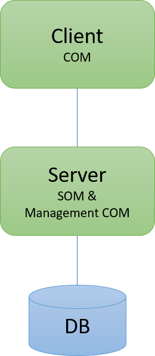
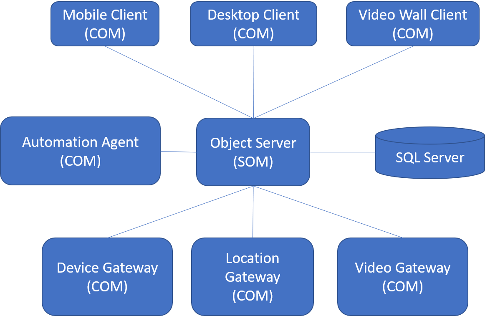

# System Design

ODOS provides the components in both server and client tier to easily design and build N-Tier applications. In the server side the main component is the Server Object Manager (SOM) and in the client side the main component is the Client Object Manager (COM). Nevertheless these components can be mixed in various configurations in the same process to form nodes that perform various tasks. For example our current standard Object Server consists of a SOM and a management COM. Other possible scenarios for mixing multiple COMs and/or SOMs is to synchronize between different systems and to create proxying and load balancing solutions. 

ODOS provides an abstraction of the underlying data store, so can be easily considered as a NoSQL object database. SOM provides an in-memory transaction engine before saving to the data store. So the data store is just a location to store the data and there is no hard dependency in any Database. In fact the data store can be missing, as someone can build an in-memory caching or data exchange system without having s data store, but will get the consistent object graph transactions of ODOS.  

In a multi-service architecture, additional special clients can perform various operations like data exchange with third party systems, automations and business rule execution. An architecture for an IoT system could look like the following diagram.

